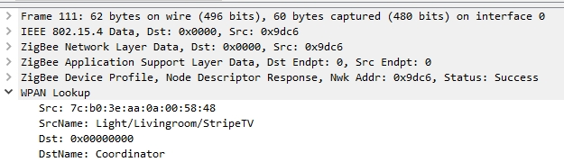
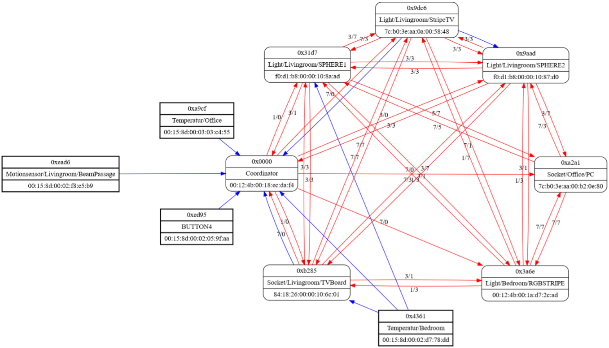

# Wireshark WPANInfo plugin

The Plugin add new fields to Wireshark for ZigBee/IEEE 802.15.4 device lookups.
  
The network map is generated as graphviz file (`WPANInfo.map.txt`) in the same folder as the script.
  
For the generation of the maps `Link Status` and device data packets are processed. 

# Installation
* Copy `WPANInfo.lookup.csv` and `WPANInfo.lua` in your "Personal Lua Plugins" folder.
* Add your devices to `WPANInfo.lookup.csv`

To enable/disable network map generation, set the variable `enable_map` to `true` or `false` in `WPANInfo.lua`.

**Tip**: to find out where your Personal Plugins folder is, open Wireshark and go to **Help->About Wireshark** and it will be listed in the **Folders** tab. You may need to create the folder the first time.

# Links
* [GraphvizOnline](https://dreampuf.github.io/GraphvizOnline)
